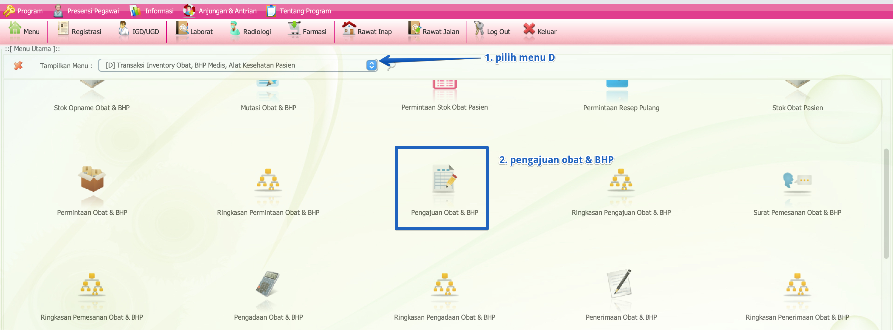

import Tabs from '@theme/Tabs';
import TabItem from '@theme/TabItem';

# PENGAJUAN BARANG FARMASI
Pengajuan barang farmasi berisi informasi tentang barang yang akan dibeli dan diajukan kepada bagian pengadaan

<Tabs>
<TabItem value="Tutorial" label="Tutorial" default>
### A. Cara Akses Menu Pengajuan Barang

Langkah-langkah :
1. **Pilih Menu D**
   - Klik pada dropdown menu dan pilih **[D] Transaksi Inventory Obat, BHP Medis, Alat Kesehatan Pasien**.
2. **Pengajuan Obat & BHP**
   - Klik ikon **Pengajuan Obat & BHP** untuk masuk ke halaman pengajuan.
### B. Input Pengajuan Barang

Langkah-langkah
1. **Cari Nama Barang**
   - Gunakan kolom Key Word untuk mencari nama barang yang ingin diajukan.
2. **Masukkan Jumlah**
   - Isi kolom jumlah sesuai dengan kebutuhan pengadaan.
3. **Ulangi untuk barang lainnya**
   - Ulangi langkah 1 dan 2 untuk barang lainnya.
4. **Isi Keterangan**
   - Tambahkan keterangan jika diperlukan, seperti alasan pengajuan atau catatan penting lainnya.
4. **Klik Simpan**
   - Setelah semua data terisi, klik tombol Simpan untuk menyimpan pengajuan.

### C. Mencari Data Tersimpan atau Riwayat Pengajuan

Klik **CARI** pada menu di bawah

Tampilan data yang sudah tersimpan

</TabItem>
<TabItem value="Struktur" label="Struktur">
## Struktur Data
</TabItem>
</Tabs>
