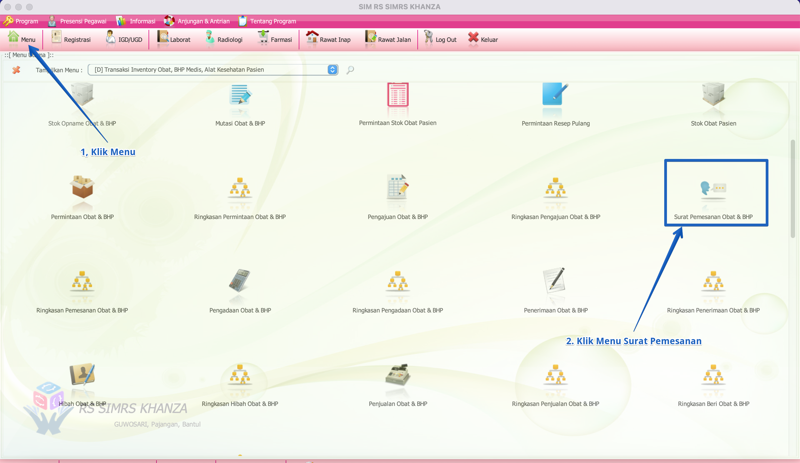
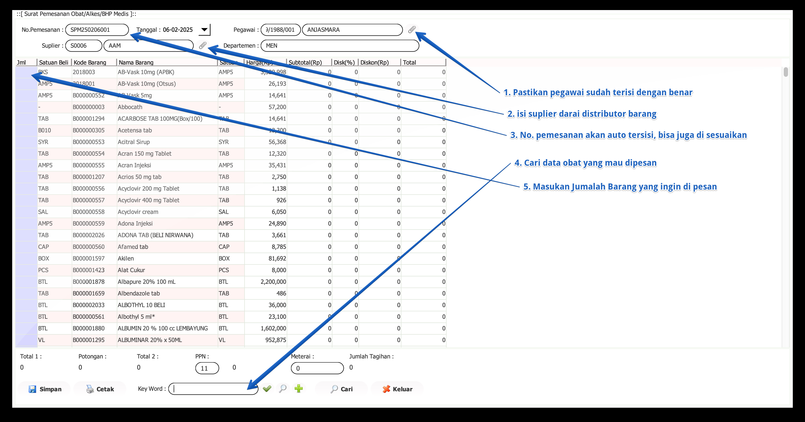

import Tabs from '@theme/Tabs';
import TabItem from '@theme/TabItem';

# SURAT PESANAN
**Surat pemesanan** (apotek) adalah dokumen resmi yang digunakan oleh apotek untuk memesan obat-obatan atau produk farmasi dari pemasok atau distributor.
<Tabs>
<TabItem value="Tutorial" label="Tutorial" default>
## Lokasi menu surat pesanan

Berikut adalah langkah-langkah menuju menu lokasi surat pemesanan:
Klik Menu:
Pada tampilan utama, klik ikon Menu di bagian atas layar.
Cari Menu Surat Pemesanan:
Di dalam menu yang muncul, cari dan klik pada opsi Surat Pemesanan Obat & BHP.

## Input surat pesanan

# Tutorial Input Surat Pemesanan Obat

1. **Pastikan Pegawai Terisi dengan Benar:**
   - Periksa bahwa nama dan nomor pegawai sudah terisi dengan benar di kolom yang tersedia.

2. **Isi Suplier:**
   - Pilih suplier dari daftar distributor barang yang tersedia.

3. **Nomor Pemesanan:**
   - Nomor pemesanan biasanya terisi otomatis. Anda dapat menyesuaikannya jika diperlukan.

4. **Cari Data Obat:**
   - Gunakan kolom pencarian untuk menemukan obat yang ingin dipesan. Pastikan nama dan kode barang sesuai.

5. **Masukkan Jumlah Barang:**
   - Di kolom "Jml", masukkan jumlah barang yang ingin Anda pesan.

6. **Simpan atau Cetak:**
   - Setelah semua data terisi dengan benar, klik tombol **Simpan** untuk menyimpan pesanan atau **Cetak** jika Anda perlu mencetak surat pemesanan.
   
   Selanjtnya klik cetak untuk mencetak surat pesanan
tampilan surat pesanan

</TabItem>
<TabItem value="Struktur" label="Struktur">
## Struktur Data
</TabItem>
</Tabs>
