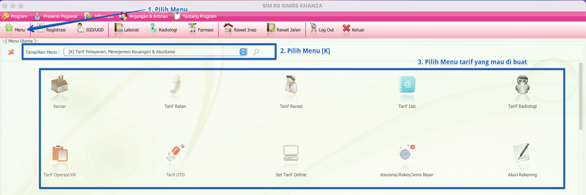

import Tabs from '@theme/Tabs';
import TabItem from '@theme/TabItem';

# TARIF PELAYANAN
Tarif pelayanan adalah 
Tarif pelayanan di rumah sakit atau fasilitas kesehatan (FASKES) adalah biaya yang dikenakan kepada pasien untuk berbagai jenis layanan medis.

Tarif pelayanan terdiri dari: Tarif Kamar, Tarif Ralan (Rawat Jalan), Tarif Ranap (Rawat Inap), Tarif Lab, Tarif Radiologi, Tarif Operasi/VK, Tarif UTD (Unit Transfusi Darah), Set Tarif Online

<Tabs>
<TabItem value="Tutorial" label="Tutorial" default>
## **Langkah Menuju Menu Tarif**

**Langkah-langkah:**
1. Pilih Menu: Klik tombol **Menu** di bagian atas layar.
2. Pilih Menu [K]: Dari dropdown yang muncul, pilih opsi [K] Tarif Pelayanan, Manajemen Keuangan & Akuntansi.
3. Pilih Menu Tarif yang Diinginkan
Setelah memilih menu [K], akan muncul beberapa pilihan menu tarif:
     - Kamar: Untuk mengatur tarif kamar rawat inap
     - Tarif Ralan: Untuk mengatur tarif layanan rawat jalan
     - Tarif Ranap: Untuk mengatur tarif layanan rawat inap
     - Tarif Lab: Untuk mengatur tarif layanan laboratorium
     - Tarif Radiologi: Untuk mengatur tarif layanan radiologi
     - Tarif Operasi/VK: Untuk mengatur tarif layanan operasi/VK
     - Tarif UTD: Untuk mengatur tarif Unit Transfusi Darah
     - Set Tarif Online: Untuk mengatur tarif layanan online

## **1. Tarif Kamar**
Tarif kamar adalah biaya yang dikenakan kepada pasien untuk menggunakan kamar rawat inap.
- Pilih Menu Kamar 

## **2. Tarif Ralan (Rawat Jalan)**
tarif ralan adalah biaya yang dikenakan kepada pasien untuk menggunakan layanan rawat jalan.

## **3. Tarif Ranap (Rawat Inap)**
tarif ranap adalah biaya yang dikenakan kepada pasien untuk menggunakan layanan rawat inap.

## **4. Tarif Lab**
tarif lab adalah biaya yang dikenakan kepada pasien untuk menggunakan layanan pemeriksaan laboratorium.

## **5. Tarif Radiologi**
## **6. Tarif Operasi/VK**
## **7. Tarif UTD (Unit Transfusi Darah)**
## **8. Set Tarif Online**

</TabItem>

<TabItem value="Struktur" label="Struktur">
## Struktur Data
</TabItem>
</Tabs>
