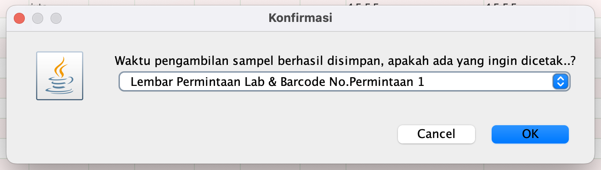

import Tabs from '@theme/Tabs';
import TabItem from '@theme/TabItem';

# PERMINTAAN LABORATORIUM
Permintaan laboratorium adalah dokumen yang berisi informasi mengenai daftar pasien yang akan menjalani pemeriksaan laboratorium, yang dikirim dari unit rawat jalan atau rawat inap. Dokumen ini mencakup data pasien, jenis pemeriksaan yang diperlukan, serta petunjuk khusus terkait prosedur atau kondisi medis yang relevan. Permintaan laboratorium ini dapat mencakup berbagai jenis laboratorium, antara lain:

1. **Laboratorium Patologi Klinik (PK):** Untuk pemeriksaan darah, urine, biokimia, dan analisis lainnya yang mendukung diagnosis klinis.
2. **Laboratorium Patologi Anatomi (PA):** Untuk pemeriksaan jaringan, biopsi, dan spesimen lain yang diperlukan untuk mendiagnosis kelainan struktural pada organ tubuh.
3. **Laboratorium Mikrobiologi:** Untuk pemeriksaan mikroorganisme penyebab infeksi, seperti bakteri, virus, jamur, dan parasit, termasuk uji sensitivitas terhadap antibiotik.

<Tabs>
<TabItem value="Tutorial" label="Tutorial" default>
### A. Cara Akses Menu Permintaan Laboratorium

Langkah-langkah :
1. Klik Menu Laboratorium
- Pada bagian atas layar, klik menu Laboratorium.
2. Pilih Permintaan Lab
- Pilih salah satu dari opsi permintaan lab yang tersedia:
    - Permintaan Lab PK
    - Permintaan Lab PA
    - Permintaan Lab MB

### B. Lab. Patologi Klinik (PK)
#### a. Ambil Sampel Laboratorium

Langkah-langkah :
1. **Klik Nama**
   - Pilih nama pasien dari daftar untuk melihat detail permintaan.
2. **Klik Sampel**
   - Klik tombol **Sampel** untuk mengisi waktu pengambilan sampel.
3. **Isi Tanggal dan Jam Pengambilan Sampel**
   - Masukkan tanggal dan jam pengambilan sampel yang sesuai dari popup.
4. **Klik Simpan** pada popup.
   - Klik tombol **Simpan** untuk menyimpan data. akan terisi waktu pengambilan sampel di sistem.

:::note
- **Filter**: Gunakan filter seperti dokter, unit/poli, dan rentang tanggal untuk menyaring data.
- **Data Permintaan**: Menampilkan detail permintaan laboratorium, termasuk jenis tes dan hasil referensi.
- **Sampel**: Menunjukkan waktu pengambilan sampel yang telah diisi.
:::

Klik Simpan pada popup. jika perlu print berkas yang di inginkan

#### b. Input Hasil Laboratorium
- Cara akses menu input hasil laboratorium.

- Input hasil laboratorium.
### C. Lab. Patologi Anatomi (PA)

### D. Lab. Mikrobiologi (MB)

</TabItem>
<TabItem value="Struktur" label="Struktur">
## Struktur Data
</TabItem>
</Tabs>
