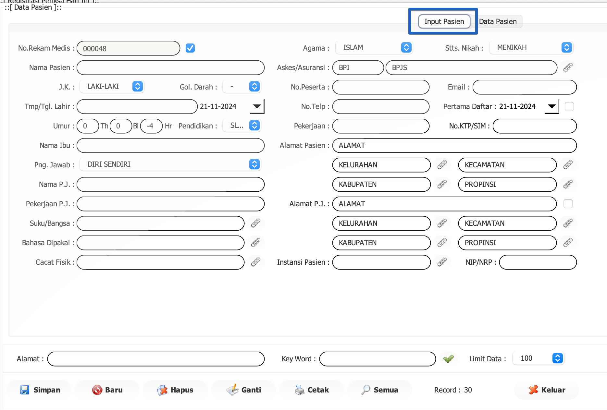

import Tabs from '@theme/Tabs';
import TabItem from '@theme/TabItem';

# Buat RM Baru
<Tabs>
  <TabItem value="tutorial" label="Tutorial" default>

a.	Masuk ke data RM
 
-	Klik menu klip pada No.Rekamedis

b.	Isi data RM sesuai dengan data pasien
 

**Keterangan :**

| **Nama**                         | **Keterangan**                                                                 |
|----------------------------------|-------------------------------------------------------------------------------|
| **No. Rekam Medis**              | Nomor unik yang diberikan kepada pasien untuk melacak riwayat medis mereka.  |
| **Nama Pasien**                  | Nama lengkap pasien.                                                         |
| **J.K. (Jenis Kelamin)**         | Jenis kelamin pasien, misalnya Laki-Laki atau Perempuan.                      |
| **Gol. Darah (Golongan Darah)**  | Golongan darah pasien, seperti A, B, AB, O, atau lainnya.                     |
| **Tmp./Tgl. Lahir (Tempat/Tanggal Lahir)** | Tempat dan tanggal lahir pasien.                                          |
| **Umur**                         | Usia pasien yang dapat dicatat dalam tahun (Th), bulan (Bl), atau hari (Hr).|
| **Pendidikan**                   | Latar belakang pendidikan atau tingkat pendidikan pasien.                    |
| **Nama Ibu**                     | Nama ibu dari pasien.                                                        |
| **Png. Jawab (Penanggung Jawab)**| Menunjukkan siapa yang bertanggung jawab terhadap pasien, seperti diri sendiri atau wali. |
| **Nama P.J. (Nama Penanggung Jawab)** | Nama orang yang bertanggung jawab terhadap pasien jika pasien masih di bawah umur atau bergantung pada orang lain. |
| **Pekerjaan P.J. (Pekerjaan Penanggung Jawab)** | Pekerjaan orang yang bertanggung jawab terhadap pasien.             |
| **Suku/Bangsa**                  | Suku atau kebangsaan pasien.                                                 |
| **Bahasa Dipakai**               | Bahasa yang digunakan oleh pasien.                                           |
| **Cacat Fisik**                  | Menunjukkan jika pasien memiliki cacat fisik atau gangguan tubuh.            |
| **Alamat Pasien**                | Alamat tempat tinggal pasien, termasuk jalan, kelurahan, kecamatan, kabupaten, dan provinsi. |
| **Alamat P.J. (Alamat Penanggung Jawab)** | Alamat orang yang bertanggung jawab terhadap pasien, jika berbeda dengan alamat pasien. |
| **Instansi Pasien**              | Instansi atau tempat kerja pasien, jika ada.                                 |
| **Agama**                        | Agama pasien, misalnya Islam, Kristen, atau lainnya.                          |
| **Status Nikah**                 | Status pernikahan pasien, seperti menikah atau belum menikah.                |
| **Askes/Asuransi**               | Jenis asuransi kesehatan pasien, seperti BPJS atau lainnya.                   |
| **No. Peserta**                  | Nomor peserta asuransi, terkait dengan asuransi atau jaminan sosial kesehatan pasien. |
| **No. Telp (Nomor Telepon)**     | Nomor telepon pasien atau penanggung jawabnya.                                |
| **Pekerjaan**                    | Pekerjaan atau profesi pasien.                                               |
| **No. KTP/SIM**                  | Nomor identitas pasien, bisa berupa KTP (Kartu Tanda Penduduk) atau SIM (Surat Izin Mengemudi). |
| **NIP/NRP**                      | Nomor identitas pegawai atau nomor registrasi, biasanya digunakan untuk pasien yang terdaftar di instansi atau organisasi tertentu. |
| **Key Word**                     | Kata kunci yang digunakan untuk mencari rekam medis pasien dalam sistem.     |

# Mencari RM Lama
isi dengan cara pendaftaran pasien baru

  </TabItem>
  <TabItem value="structure" label="Structure">
    ## Struktur RM Baru
    Di sini Anda dapat menjelaskan struktur data atau proses yang terkait dengan pembuatan rekam medis baru.
  </TabItem>
</Tabs>
