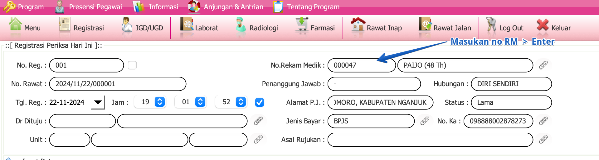
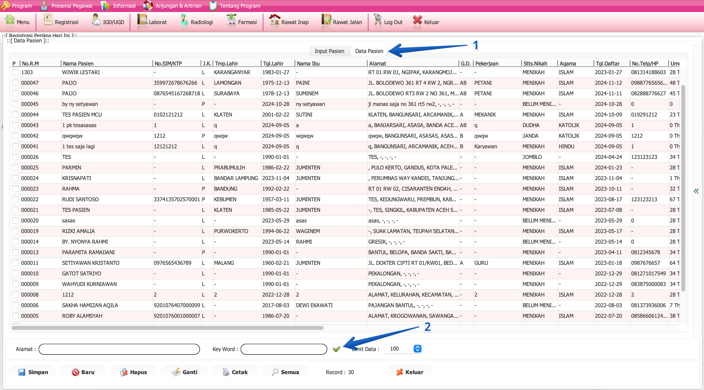
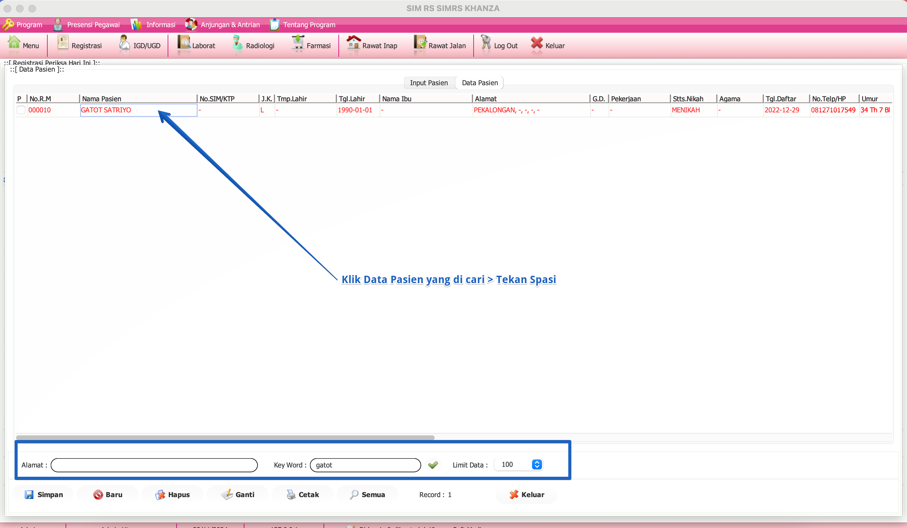

import Tabs from '@theme/Tabs';
import TabItem from '@theme/TabItem';

# Buat RM Baru
**Nomor Rekam Medis (RM)** adalah elemen kunci dalam sistem rekam medis pasien, berfungsi sebagai identifikasi unik yang diberikan kepada setiap pasien di fasilitas kesehatan. Nomor ini memungkinkan penyedia layanan kesehatan untuk melacak dan mengakses riwayat kesehatan pasien dengan cepat dan akurat. 

Dengan menggunakan Nomor Rekam Medis, informasi penting seperti diagnosis, perawatan sebelumnya, hasil laboratorium, dan catatan medis lainnya dapat diakses dengan mudah, memastikan bahwa pasien menerima perawatan yang tepat dan terkoordinasi. Nomor ini juga membantu dalam menjaga kerahasiaan dan keamanan data pasien, karena hanya individu yang berwenang yang dapat mengakses informasi tersebut melalui sistem yang terintegrasi.

<Tabs>
  <TabItem value="tutorial" label="Tutorial" default>

## **A. Sudah tahu No.RM**

- Masukan no.rm pada kolom No.Rekam Medis kemudian enter

## **B. Tidak tahu No.RM**

- Klik menu klip pada No.Rekam Medis di form pendaftaran
- Masukkan Nama atau data untuk mencari di kolom pencarian:
  - Alamat : Bisa diisi dengan nama desa/kelurahan, kecamatan, kabupaten/kota
  - Key. Word : Bisa diisi dengan nama pasien, no.ktp atau yang lainya
  

- Klik pada nama pasien yang dicari
- Tekan Spasi
- Data Akan masuk ke kolom No.Rekam Medis yang berada di form pendaftaran

# Terima Kasih

  </TabItem>
  <TabItem value="structure" label="Structure">
    ## struktur data
    struktur data sama dengan pendaftaran pasien baru
  </TabItem>
</Tabs>
