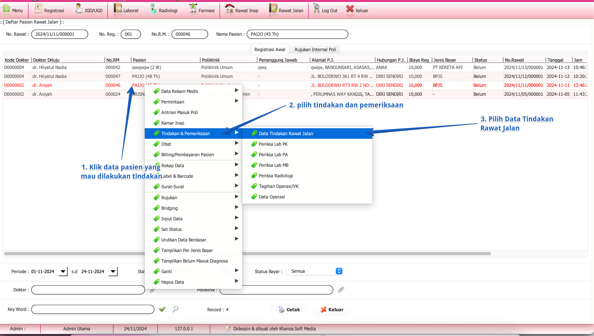

import Tabs from '@theme/Tabs';
import TabItem from '@theme/TabItem';

# BERANDA RAWAT JALAN
Keterangan beranda rawat jalan
<Tabs>
<TabItem value="Tutorial" label="Tutorial" default>
## A. Tampilan Beranda Rawat Jalan

Keterangan tampilan beranda rawat jalan :

**1. Navigasi cepat ke berbagai layanan Rawat Jalan.**

**2. Tampilan kunjungan pasien rawat jalan sesuai dengan yang dipilih.**
- **Registrasi awal**: Tampilan kunjungan pasien rawat jalan.
- **Rujukan internal Poli**: Tampilan kunjungan Rujukan internal dari poli lain.

**3. Pensortiran data:**
- **Dokter**: Kolom ini digunakan untuk memfilter data pasien berdasarkan nama dokter yang menangani. Anda bisa menggunakan tombol **Klip** di sebelah kanan untuk memilih dokter dari daftar yang tersedia. Fitur ini mempermudah pencarian data pasien berdasarkan dokter tertentu.
- **Unit**: Kolom ini digunakan untuk memfilter data berdasarkan unit medis atau departemen, seperti poliklinik, rawat inap, atau laboratorium. Anda bisa klik tombol **Klip** di sebelah kanan untuk memilih dari daftar unit yang tersedia. Dengan memilih unit, Anda bisa melihat data pasien yang ditangani di departemen tersebut.
- **Periode**: Filter ini digunakan untuk menampilkan data pasien dalam rentang waktu tertentu. Anda dapat memilih tanggal awal dan tanggal akhir menggunakan ikon kalender. Fitur ini berguna untuk mencari data pasien yang terdaftar atau diperiksa dalam periode waktu tertentu.
- **Periode**: Filter ini digunakan untuk menampilkan data pasien dalam rentang waktu tertentu. Anda dapat memilih tanggal awal dan tanggal akhir menggunakan ikon kalender. Fitur ini berguna untuk mencari data pasien yang terdaftar atau diperiksa dalam periode waktu tertentu.
- **Key Word**: Kolom ini memungkinkan Anda untuk memasukkan kata kunci spesifik, seperti nama pasien, nomor rekam medis, atau informasi lain yang relevan. Fitur ini digunakan untuk memfilter data secara cepat berdasarkan kata kunci yang Anda masukkan. Klik tombol **√ (centang hihjau)** di sebelah kanan untuk menjalankan filter dan menampilkan data yang sesuai dengan kriteria pencarian.

## B. Memilih Pasien Untuk Dilakukan Tindakan

KETERANGAN :
#### Langkah-Langkah:

1. **Pilih Pasien** : Klik baris pasien yang akan dilakukan tindakan.
2. **Klik Tindakan & Pemeriksaan** : Klik kanan pada pasien, lalu pilih **Tindakan & Pemeriksaan**.
3. **Pilih Data Tindakan Rawat Jalan** : Dari menu yang muncul, klik **Data Tindakan Rawat Jalan**.
Selesai! Data tindakan pasien sudah siap diproses.

:::note
**Cara Cepat**
Dobel Klik atau tekan spasi pada kode dokter, maka akan langsung tampil menu tindakan dan pemeriksaan.
:::

</TabItem>
<TabItem value="Struktur" label="Struktur">
# isi dengan struktur
</TabItem>
</Tabs>
