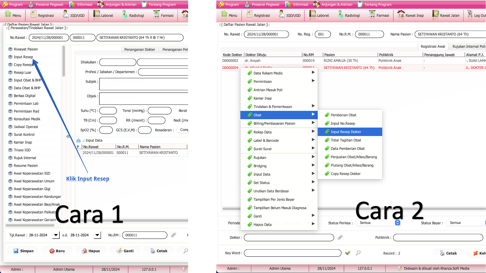
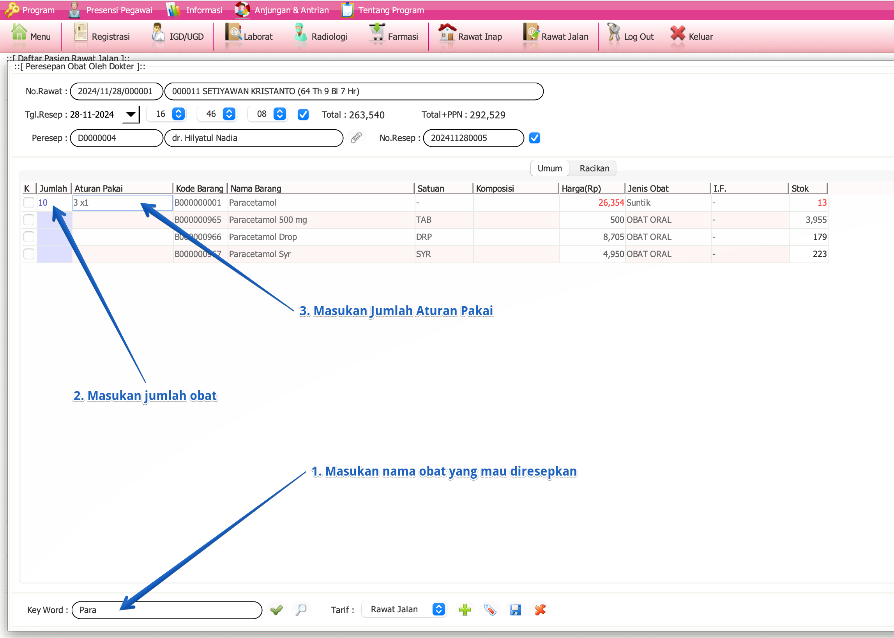

import Tabs from '@theme/Tabs';
import TabItem from '@theme/TabItem';

<Tabs>
  <TabItem value="tutorial" label="Tutorial" default>
# Input Resep

## A. Menu Input Resep

## Langkah-langkah: 
### Cara 1: Menggunakan Menu Samping

1. **Klik Menu "Input Resep"**
   - Pada panel menu di sebelah kiri, cari dan klik **Input Resep**.
2. **Isi Form Resep**
   - Masukkan informasi resep yang diperlukan pada form yang tersedia.
3. **Masuk ke Form Resep**
   - Setelah mengisi form, klik tombol **Simpan** untuk menyimpan data resep.

### Cara 2: Menggunakan Klik Kanan
1. **Klik Kanan pada Nama Pasien**
   - Di daftar pasien, klik kanan pada nama pasien yang ingin Anda input resepnya.
2. **Pilih Menu "Obat"**
   - Arahkan kursor ke menu **Obat**.
3. **Pilih "Input Resep Dokter"**
   - Klik **Input Resep Dokter** dari submenu yang muncul.
4. **Masuk ke Form Resep**
   - Setelah mengisi form, klik tombol **Simpan** untuk menyimpan data resep.

## B. Form Resep

## Langkah-langkah:
1. **Masukkan Nama Obat yang Mau Diresepkan**
   - Pada kolom **Key Word**, ketik nama obat yang ingin Anda resepkan.

2. **Masukkan Jumlah Obat**
   - Di kolom **Jumlah**, masukkan jumlah obat yang akan diberikan kepada pasien.
   - Akhiri dengan menekan tombol **Enter**
   - tekan tombol **Kanan** (di keyboard) untuk pindah ke kolom aturan pakai

3. **Masukkan Jumlah Aturan Pakai**
   - Pada kolom **Aturan Pakai**, masukkan instruksi penggunaan obat, seperti dosis dan frekuensi pemakaian (misalnya, 3x1).
   - Akhiri dengan menekan tombol **Enter**

4. **Ulangi Langkah 1, 2, dan 3 untuk Obat Lainnya**
5. **Klik Tombol Simpan**
   - Setelah mengisi form, klik tombol **Simpan** untuk menyimpan data resep.

Dengan mengikuti langkah-langkah di atas, Anda dapat mengisi resep obat untuk pasien dengan benar.
  </TabItem>
  <TabItem value="keterangan" label="Keterangan">
# Keterangan
  </TabItem>
</Tabs>

# Input Resep

