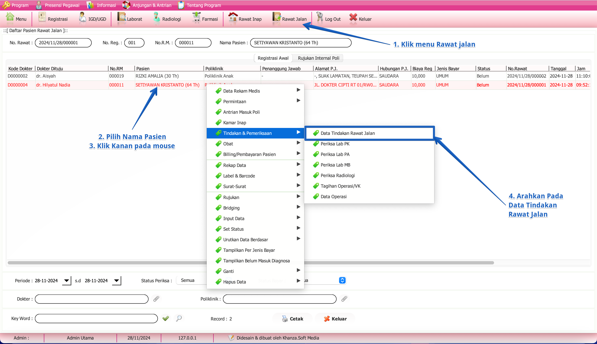
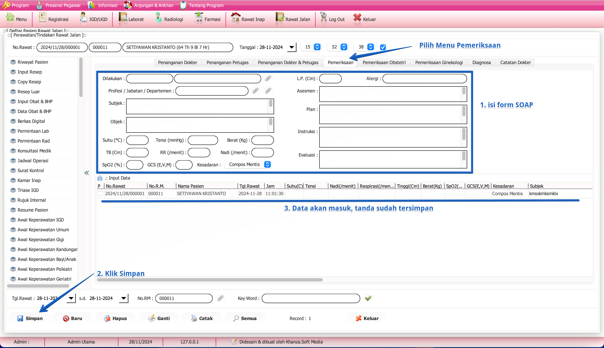

# SOAP RAWAT JALAN
Dalam sistem rekam medis, assessment ulang umumnya dicatat menggunakan format **SOAP** (Subjective, Objective, Assessment, Plan), yang memungkinkan dokumentasi yang sistematis dan terstruktur.

**Assessment ulang** (atau *reassessment*) dalam konteks rekam medis merujuk pada proses evaluasi kembali terhadap kondisi pasien setelah intervensi medis atau terapi tertentu. Tujuan utama dari assessment ulang adalah untuk menilai apakah perawatan atau tindakan yang diberikan sebelumnya telah memberikan hasil yang diinginkan, memonitor perkembangan kondisi pasien, serta membuat penyesuaian yang diperlukan dalam perawatan atau pengobatan. Proses ini penting untuk memastikan bahwa pasien menerima perawatan yang sesuai dengan kondisi terkini mereka, serta untuk mengidentifikasi perubahan atau kebutuhan baru dalam manajemen medis pasien.

## A. Langkah SOAP

### Langkah-langkah

1. **Klik Menu Rawat Jalan**
   - Pada bagian atas layar, cari dan klik menu **Rawat Jalan**.
2. **Pilih Nama Pasien**
   - Di daftar pasien, cari nama pasien yang ingin Anda akses datanya.
3. **Klik Kanan pada Nama Pasien**
   - Setelah menemukan nama pasien, klik kanan pada nama tersebut untuk membuka menu konteks.
4. **Arahkan ke Tindakan & Pemeriksaan**
   - Dalam menu konteks yang muncul, arahkan kursor ke opsi **Tindakan & Pemeriksaan**.
5. **Pilih Data Tindakan Rawat Jalan**
   - Dari submenu yang muncul, klik **Data Tindakan Rawat Jalan** untuk melihat informasi lebih lanjut.

:::tip
Dengan **Doble Klik atau Klik 2x** pada kode dokter, maka akan langsung tampil di bagian bawah.    
:::
   
## B. Dashboard SOAP

### Langkah-langkah
1. **Isi Form SOAP**
   - Pada tab **Pemeriksaan**, isi form dengan informasi yang sesuai:
     - **Subjek**: Masukkan keluhan atau informasi dari pasien.
     - **Objek**: Catat temuan dari pemeriksaan fisik.
     - **Asesmen**: Tulis diagnosis atau penilaian kondisi pasien.
     - **Plan**: Rencanakan tindakan atau perawatan yang akan dilakukan.
2. **Klik Simpan**
   - Setelah semua data diisi, klik tombol **Simpan** di bagian bawah untuk menyimpan data.
3. **Data Tersimpan**
   - Setelah menyimpan, data akan masuk dan tanda bahwa data sudah tersimpan akan muncul di tabel di bawah form.
