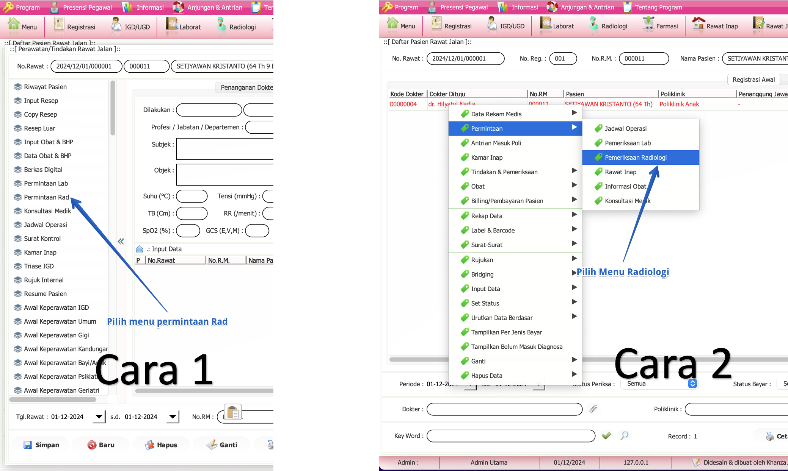
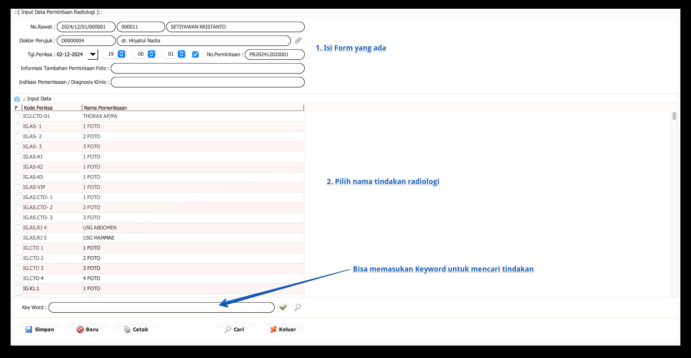

import Tabs from '@theme/Tabs';
import TabItem from '@theme/TabItem';

# Permintaan Radiologi
Permintaan radiologi adalah proses pengajuan permintaan untuk pemeriksaan medis menggunakan teknologi radiologi, seperti X-ray, CT scan, MRI, dan lainnya. dilakukan oleh dokter atau petugas rawat jalan.

<Tabs>
<TabItem value="Tutorial" label="Tutorial" default>
## Langkah Awal Permintaan Radiologi

Ada 2 langkah untuk mengakses permintaan Radiologi :
### Cara 1: Menggunakan Menu Samping

1. **Pilih Menu Permintaan Rad**
   - Pada panel menu di sebelah kiri, cari dan klik **Permintaan Rad**.

### Cara 2: Menggunakan Klik Kanan
1. **Klik Kanan pada Nama Pasien**
   - Di daftar pasien, klik kanan pada nama pasien yang ingin Anda buatkan permintaan radiologi.
2. **Pilih Menu "Permintaan"**
   - Arahkan kursor ke menu **Permintaan**.
3. **Pilih "Pemeriksaan Radiologi"**
   - Klik **Pemeriksaan Radiologi**
---
## Permintaan Lab. Patologi Klinik

Langkah-langkah pengisian:
# Tutorial Input Data Permintaan Radiologi

## Langkah-langkah

1. **Isi Form yang Ada**
   - Lengkapi form dengan informasi berikut:
     - **No. Rawat**: Nomor rawat pasien(otomatis).
     - **Dokter Perujuk**: Nama dokter yang merujuk(otomatis).
     - **Tgl. Periksa**: Tanggal pemeriksaan yang diinginkan(otomatis).
     - **No. Permintaan**: Nomor permintaan radiologi(otomatis).
     - **Informasi Tambahan Permintaan Foto**: Tambahkan informasi tambahan jika diperlukan.
     - **Indikasi Pemeriksaan / Diagnosis Klinis**: Masukkan indikasi atau diagnosis klinis.

2. **Pilih Nama Tindakan Radiologi**
   - Pilih tindakan radiologi yang diinginkan dari daftar yang tersedia.

3. **Gunakan Keyword untuk Mencari Tindakan**
   - Masukkan kata kunci di kolom **Key Word** untuk mencari tindakan radiologi tertentu.

4. **Simpan**
   - Klik tombol **Simpan** untuk menyimpan permintaan pemeriksaan radiologi.

</TabItem>
<TabItem value="Struktur" label="Struktur">
## Struktur Data
</TabItem>
</Tabs>
