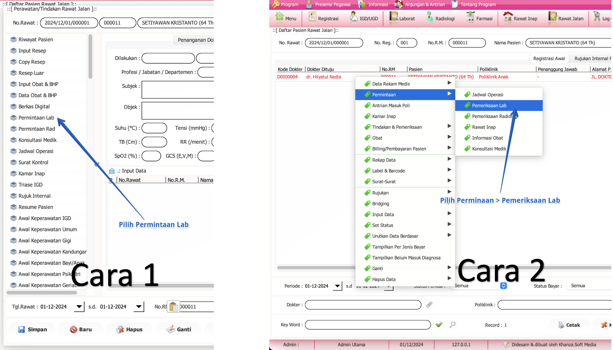
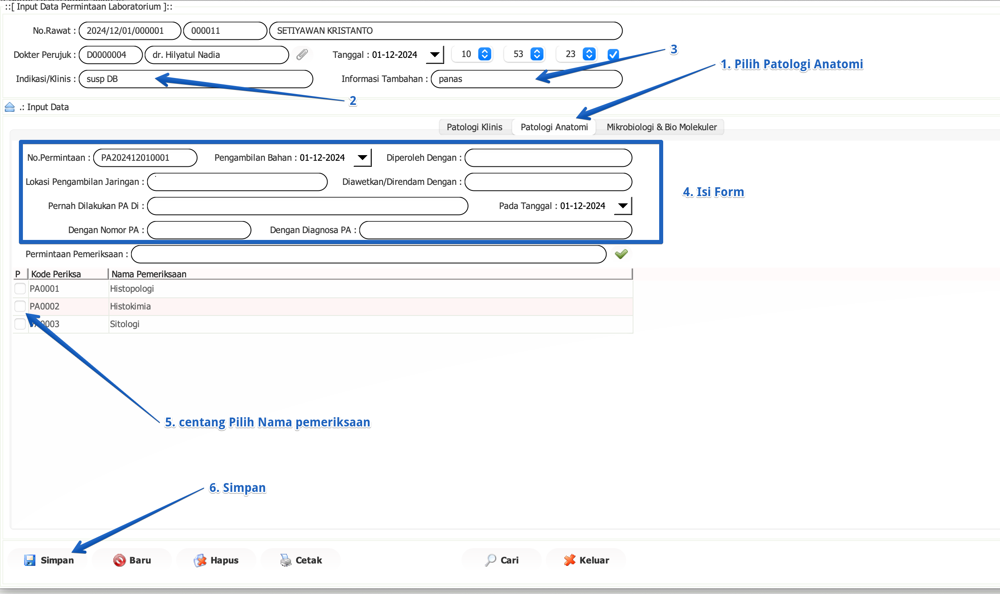
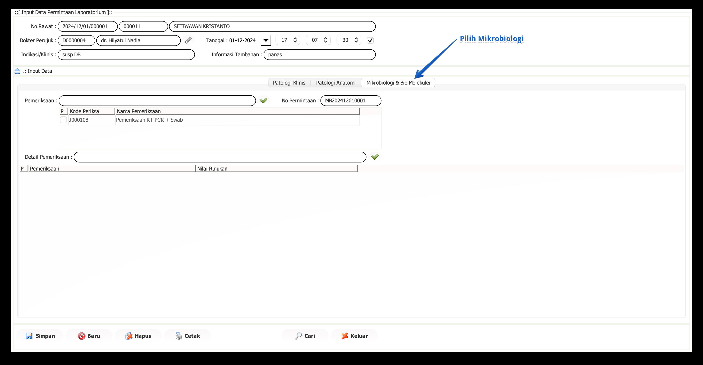

import Tabs from '@theme/Tabs';
import TabItem from '@theme/TabItem';

# Permintaan Laboratorium
Pengisian permintaan laboratorium adalah langkah untuk meminta pemeriksaan laboratorium dari pasien rawat jalan, yang akan dikerjakan oleh laboratorium. Yang mengisi adalah dokter atau perawat di ruang rawat jalan.

<Tabs>
<TabItem value="Tutorial" label="Tutorial" default>
## Langkah Awal Permintaan Lab.

Ada 2 langkah untuk mengakses permintaan laboratorium :

**Cara 1:** Menggunakan Menu Samping
- **Pilih Permintaan Lab**, Pada panel menu di sebelah kiri, cari dan klik **Permintaan Lab**.

**Cara 2:** Menggunakan Klik Kanan

- **Klik Kanan pada Nama Pasien**,Di daftar pasien, klik kanan pada nama pasien yang ingin Anda buatkan permintaan lab.
- **Pilih Menu "Permintaan"**, Arahkan kursor ke menu Permintaan.
- **Pilih "Pemeriksaan Lab"**, Klik Pemeriksaan Lab dari submenu yang muncul.
---
## Permintaan Lab. Patologi Klinik

Langkah-langkah pengisian:

1. **Isi Indikasi Dilakukan**
   - Masukkan indikasi atau alasan klinis untuk pemeriksaan di kolom **Indikasi/Klinis**.
2. **Berikan Informasi Tambahan**
   - Tambahkan informasi tambahan yang relevan di kolom **Informasi Tambahan**.
3. **Cari Pemeriksaan yang Mau Dilakukan**
   - Gunakan kolom pencarian untuk menemukan jenis pemeriksaan yang diperlukan.
4. **Centang Induk dari Pemeriksaan yang Diinginkan**
   - Centang kotak di sebelah nama pemeriksaan induk yang ingin dilakukan.
5. **Centang Template atau Komponen dari Pemeriksaan yang Mau Dilakukan**
   - Pilih komponen atau detail pemeriksaan yang diperlukan dengan mencentang kotak yang sesuai.
6. **Ulangi Langkah 3-5**
   - Jika ada pemeriksaan lain yang ingin ditambahkan, ulangi langkah 3-5.
7. **Simpan**
   - Klik tombol **Simpan** untuk menyimpan permintaan pemeriksaan laboratorium.
---
## Permintaan Lab. Patologi Anatomi

Langkah-langkah pengisian:

1. **Pilih Patologi Anatomi**
   - Klik tab **Patologi Anatomi** untuk memulai permintaan pemeriksaan.
2. **Isi Indikasi/Klinis**
   - Masukkan indikasi atau alasan klinis di kolom **Indikasi/Klinis**.

3. **Berikan Informasi Tambahan**
   - Tambahkan informasi tambahan yang relevan di kolom **Informasi Tambahan**.

4. **Isi Form**
   - Lengkapi form dengan informasi berikut:
 - Lengkapi form dengan informasi berikut:
     - **No. Permintaan**: Nomor unik yang digunakan untuk mengidentifikasi permintaan pemeriksaan laboratorium *(terisi secara otomatis)*.
     - **Pengambilan Bahan**: Tanggal dan waktu pengambilan sampel atau bahan untuk pemeriksaan.
     - **Lokasi Pengambilan Jaringan**: Tempat atau bagian tubuh dari mana sampel jaringan diambil.
     - **Diperoleh Dengan**: Metode atau alat yang digunakan untuk memperoleh sampel.
     - **Pernah Dilakukan PA Di**: Informasi apakah pemeriksaan patologi anatomi sebelumnya pernah dilakukan, dan jika ya, di mana.
     - **Dengan Nomor PA**: Nomor referensi dari pemeriksaan patologi anatomi sebelumnya, jika ada.
     - **Dengan Diagnosa PA**: Diagnosa yang diberikan berdasarkan pemeriksaan patologi anatomi sebelumnya, jika ada.

5. **Centang Pilih Nama Pemeriksaan**
   - Pilih jenis pemeriksaan yang diinginkan dengan mencentang kotak di sebelah nama pemeriksaan.

6. **Simpan**
   - Klik tombol **Simpan** untuk menyimpan permintaan pemeriksaan laboratorium.
---
## Permintaan Lab. Mikrobiologi

Langkah-langkah pengisian:

1. **Isi Indikasi Dilakukan**
   - Masukkan indikasi atau alasan klinis untuk pemeriksaan di kolom **Indikasi/Klinis**.
2. **Berikan Informasi Tambahan**
   - Tambahkan informasi tambahan yang relevan di kolom **Informasi Tambahan**.
3. **Cari Pemeriksaan yang Mau Dilakukan**
   - Gunakan kolom pencarian untuk menemukan jenis pemeriksaan yang diperlukan.
4. **Centang Induk dari Pemeriksaan yang Diinginkan**
   - Centang kotak di sebelah nama pemeriksaan induk yang ingin dilakukan.
5. **Centang Template atau Komponen dari Pemeriksaan yang Mau Dilakukan**
   - Pilih komponen atau detail pemeriksaan yang diperlukan dengan mencentang kotak yang sesuai.
6. **Ulangi Langkah 3-5**
   - Jika ada pemeriksaan lain yang ingin ditambahkan, ulangi langkah 3-5.
7. **Simpan**
   - Klik tombol **Simpan** untuk menyimpan permintaan pemeriksaan laboratorium.

</TabItem>
<TabItem value="Struktur" label="Struktur">
## Struktur Data
</TabItem>
</Tabs>