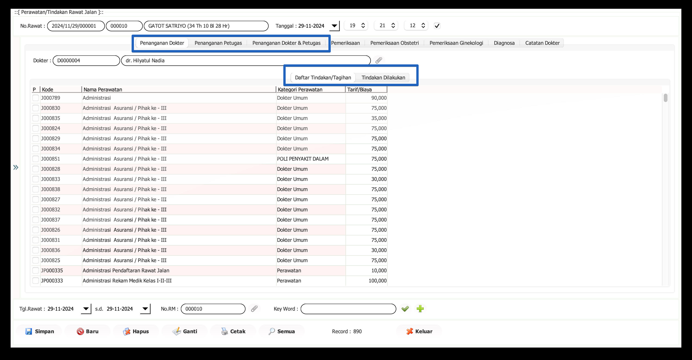
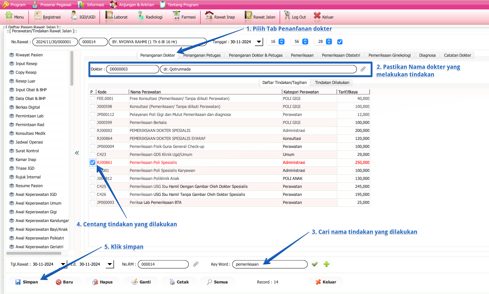

import Tabs from '@theme/Tabs';
import TabItem from '@theme/TabItem';

# INPUT TINDAKAN
**Input Tindakan** dalam SIMKES Khanza mencatat berbagai kegiatan medis yang dilakukan oleh tenaga kesehatan, seperti dokter dan perawat, untuk merawat pasien. Setiap tindakan yang dilakukan juga **terhubung dengan tarif** yang telah ditetapkan oleh fasilitas kesehatan (faskes) untuk memudahkan administrasi.

Ada tiga jenis tarif tindakan yang diterapkan, yaitu **tindakan dokter**, **tindakan petugas medis**, dan **tindakan gabungan antara dokter dan petugas**. Tarif ini disesuaikan dengan jenis tindakan dan tenaga medis yang terlibat, memastikan transparansi biaya dan kemudahan pencatatan tagihan.
<Tabs>
<TabItem value="Tutorial" label="Tutorial" default>

## A. Tampilan Input Tindakan

Keterangan:

**Tab Penanganan**
- **Penanganan Dokter**: Menampilkan informasi terkait dokter yang menangani pasien.
- **Penanganan Petugas**: Menampilkan informasi terkait petugas yang terlibat dalam perawatan.
- **Penanganan Dokter & Petugas**: Kombinasi informasi

**Daftar Tindakan/Tagihan**
- Menampilkan daftar tindakan atau layanan yang akan diberikan kepada pasien beserta tarif atau biayanya.

**Tindakan Dilakukan**
- Menunjukkan tindakan yang telah dilakukan selama perawatan pasien.

## B. Langkah-langkah Input Tindakan

Langkah-langkah:
1. **Pilih Tab Penanganan Dokter**
   - Klik tab **Penanganan Dokter** untuk melihat daftar tindakan yang dapat dilakukan.
2. **Pastikan Nama Dokter yang Melakukan Tindakan**
   - Periksa dan pastikan nama dokter yang akan melakukan tindakan sudah benar.
3. **Cari Nama Tindakan yang Dilakukan**
   - Gunakan kolom **Key Word** untuk mencari nama tindakan yang akan dilakukan.
4. **Centang Tindakan yang Dilakukan**
   - Di daftar tindakan, centang kotak di sebelah tindakan yang telah dilakukan.
5. **Ulangi Untuk Tindakan Lainnya**
   - Jika terdapat tindakan lain yang akan dilakukan, ulangi langkah 1-4.
6. **Klik Simpan**
   - Setelah memilih tindakan, klik tombol **Simpan** untuk menyimpan data tindakan yang telah dilakukan.

:::note
Anda dapat melihat daftar tindakan yang telah dilakukan atau yang sudah di input pada tab **Tindakan Dilakukan**
:::

:::warning
Anda dapat mengulangi langkah 1-6 untuk menambahkan tindakan lainnya pada **penanganan petugas atau penanganan dokter & petugas**.
:::
</TabItem>
<TabItem value="Struktur" label="Struktur">
# isi dengan struktur
</TabItem>
</Tabs>