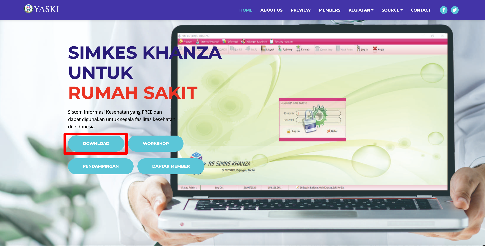
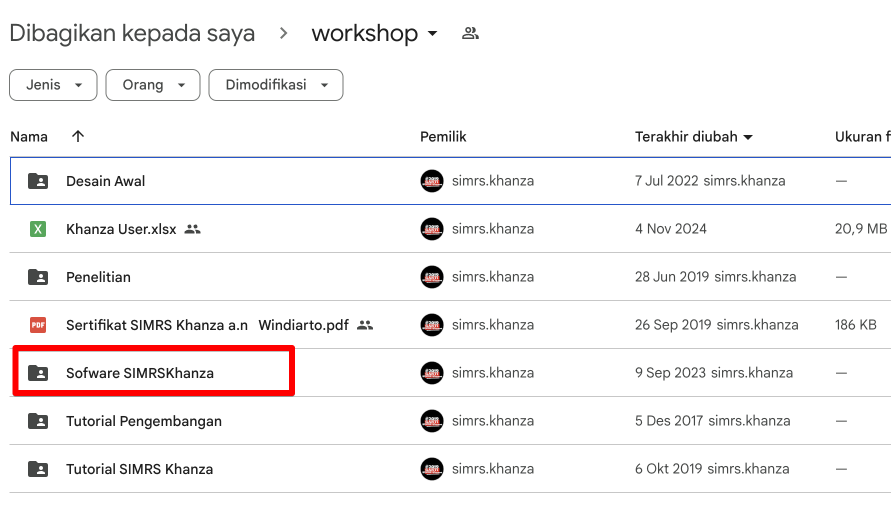
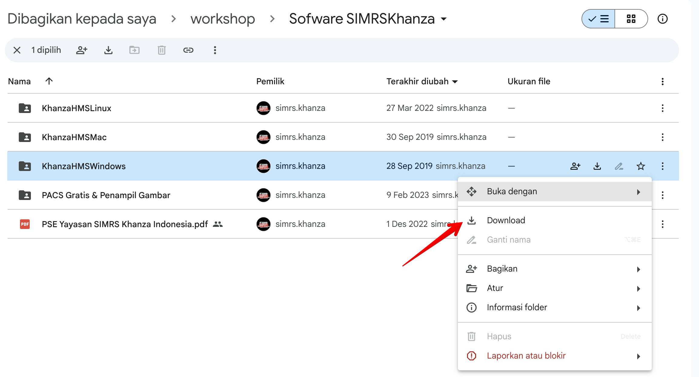
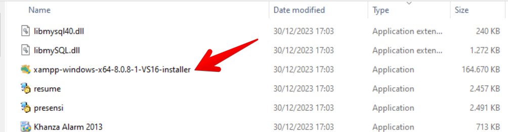

import Tabs from '@theme/Tabs';
import TabItem from '@theme/TabItem';

cara instalasi server
<Tabs>
<TabItem value="windows" label="Windows" default>
# Panduan Instalasi Khanza di Windows

Ikuti langkah-langkah di bawah ini untuk menginstal Khanza di sistem operasi Windows.

## 1. Instalasi OS Windows
Pastikan sistem operasi Windows telah terinstal dengan baik. Jika belum, instal Windows terlebih dahulu sesuai petunjuk instalasi Windows.

## 2. Download Beberapa Keperluan

### a. Buka Link Download
- Kunjungi situs [Yaski.or.id](https://www.yaski.or.id/) untuk mendapatkan file yang diperlukan.
- Klik link download

### b. Masuk ke Google Drive
- Setelah membuka situs, Anda akan diarahkan ke Google Drive untuk mengunduh file yang dibutuhkan.

### c. Download `KhanzaHMSWindows`
- Masuk ke folder `Software SIMRSKhanza\KhanzaHMSWindows` yang tersedia di Google Drive.
- Klik kanan pada file `KhanzaHMSWindows` dan pilih `Download`.

### d. Unzip File
- Setelah file selesai diunduh, ekstrak file ZIP menggunakan aplikasi pengarsipan seperti **WinRAR** atau **7-Zip**.

## 3. Install XAMPP

- Buka folder hasil ekstrak file `khanzaHMSWindows` dan temukan installer **XAMPP**.

- Jalankan installer XAMPP dan ikuti langkah-langkah instalasi.

- Pilih **Apache** dan **MySQL** selama instalasi karena keduanya dibutuhkan untuk menjalankan aplikasi web.

## 4. Buat Database Sik

- Setelah XAMPP berhasil diinstal, buka **XAMPP Control Panel** dan jalankan **Apache** serta **MySQL**.
- Akses **phpMyAdmin** melalui browser dengan membuka `http://localhost/phpmyadmin`.
- Buat database baru untuk aplikasi Khanza dengan nama `sik` atau nama lain sesuai kebutuhan.

## 5. Import Database

- Di phpMyAdmin, pilih database yang baru saja Anda buat.
- Klik tab **Import** dan pilih file database yang disediakan dalam folder `khanzaHMSWindows` (biasanya file `.sql`).
- Klik **Go** untuk mengimpor database ke dalam MySQL.

## 6. Buat Folder `webapps` di `htdocs`

- Navigasi ke direktori instalasi XAMPP, biasanya terletak di `C:\xampp\htdocs`.
- Buat folder baru dengan nama **webapps**.
- Pindahkan seluruh file dan folder dari hasil ekstraksi file `khanzaHMSWindows` ke dalam folder **webapps** yang baru dibuat.

## 7. Ubah Privileges (Agar Data Bisa Diakses Klien)

- Pastikan file dan folder yang dipindahkan memiliki izin yang benar agar dapat diakses oleh aplikasi web dan klien.
- Anda dapat mengubah izin menggunakan **File Explorer** atau perintah **chmod** (jika menggunakan WSL atau Cygwin) untuk memberi akses baca-tulis ke folder **webapps** dan file di dalamnya.

## Selesai

Setelah mengikuti langkah-langkah di atas, Anda seharusnya sudah dapat menjalankan aplikasi Khanza di Windows. Akses aplikasi melalui browser dengan mengunjungi `http://localhost/webapps`.

Jika ada masalah, pastikan Apache dan MySQL sudah berjalan dengan baik di XAMPP dan pastikan database sudah terimpor dengan benar.

</TabItem>
<TabItem value="linux" label="Linux">
isi cara instalasi di linux untuk server
</TabItem>
<TabItem value="macos" label="MacOS">
isi cara instalasi di macos untuk server
</TabItem>
</Tabs>

